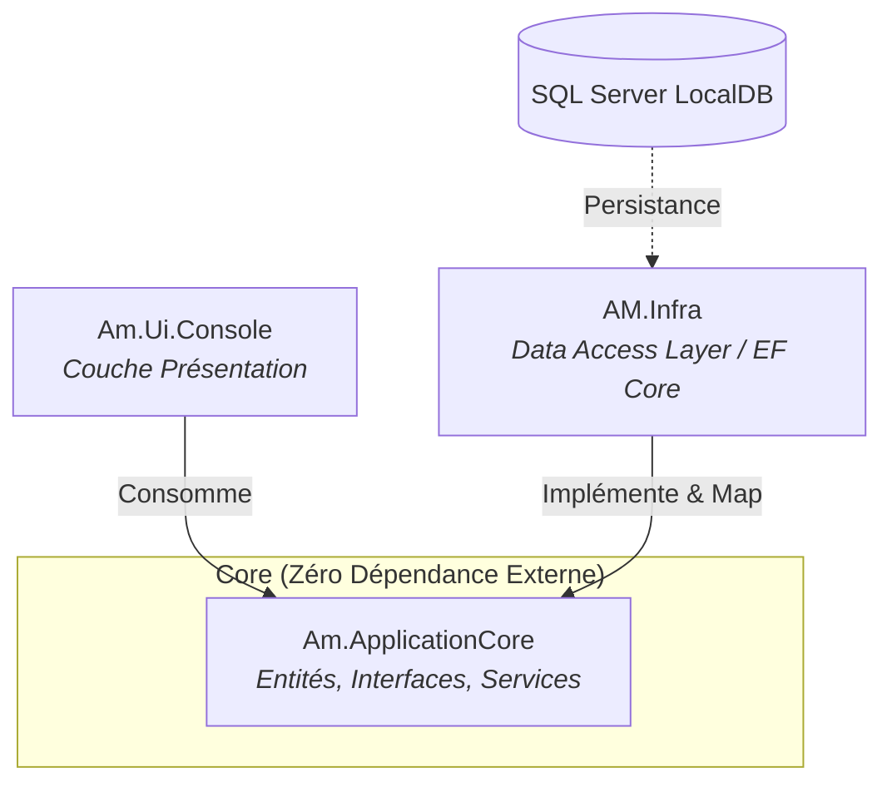

<div align="center">
  <h1>🛫 Airport Management Enterprise API</h1>
  <p><strong>Système de gestion aéroportuaire robuste, évolutif et orienté objet construit sur .NET 10.</strong></p>

  [](#)
  [](#)
  [](#)
  [](#)
</div>

---

## 📖 Sommaire
- [Architecture & Design Pattern](#-architecture--design-pattern)
- [Prérequis (Toolchain)](#-prérequis-toolchain)
- [Démarrage Rapide (Local)](#-démarrage-rapide-local)
- [Gestion de la Base de Données (EF Core)](#-gestion-de-la-base-de-données-ef-core)
- [Structure du Projet](#-structure-du-projet)
- [Standards DevOps & Bonnes Pratiques](#-standards-devops--bonnes-pratiques)

---

## 🏛 Architecture & Design Pattern

Le projet suit les principes de la **Clean Architecture** (Séparation des préoccupations). La couche métier (Domain) est totalement isolée des détails d'implémentation de la persistance des données.



### Concepts Clés Implémentés
- **Polymorphisme & Stratégies d'Héritage** : Configuration de la hiérarchie `Passenger` -> `Traveller` / `Staff` via la stratégie **TPH (Table-Per-Hierarchy)**.
- **Lazy Loading** : Configuration avancée des Proxies EF Core pour minimiser les requêtes SQL (N+1).
- **Fluent API & Data Annotations** : Validation stricte des données et mapping relationnel complexe (ex: table porteuse `Ticket`).

---

## 🛠 Prérequis (Toolchain)

Pour orchestrer ce projet sur votre machine, assurez-vous d'avoir les outils suivants :
* **[.NET 10 SDK](https://dotnet.microsoft.com/download)** (Indispensable pour la compilation).
* **[SQL Server Express LocalDB](https://docs.microsoft.com/en-us/sql/database-engine/configure-windows/sql-server-express-localdb)** ou une instance SQL Server standard.
* **CLI Entity Framework Core** (Outil global) :
  ```bash
  dotnet tool install --global dotnet-ef
  ```

---

## 🚀 Démarrage Rapide (Local)

**1. Cloner et restaurer les dépendances**
```bash
git clone <repository-url>
cd AirportManagement
dotnet restore
```

**2. Construire la solution**
```bash
dotnet build --configuration Debug
```

**3. Lancer l'environnement de test console**
```bash
dotnet run --project Am.Ui.Console
```

---

## 🗄 Gestion de la Base de Données (EF Core)

En tant que Ninja DevOps, la gestion des migrations doit être scriptable et maîtrisée. Toutes les commandes EF doivent être exécutées depuis le dossier racine de la solution.

**Générer la base de données (Update) :**
Applique toutes les migrations en attente sur votre LocalDB.
```bash
dotnet ef database update --project AM.Infra --startup-project Am.Ui.Console
```

**Ajouter une nouvelle migration :**
Si vous modifiez les entités dans `Am.ApplicationCore`, générez un nouveau delta :
```bash
dotnet ef migrations add <NomDeLaMigration> --project AM.Infra --startup-project Am.Ui.Console
```

**Rollback d'une migration :**
Pour annuler la dernière migration appliquée :
```bash
dotnet ef migrations remove --project AM.Infra --startup-project Am.Ui.Console
```

---

## 📂 Structure du Projet

```text
AirportManagement/
├── Am.ApplicationCore/      # 🧠 Cœur Métier (Domain)
│   ├── Domain/              # Modèles (Flight, Passenger, Plane, Ticket...)
│   ├── Interfaces/          # Contrats (IFlightMethods...)
│   └── Services/            # Logique métier et requêtes LINQ
│
├── AM.Infra/                # 💾 Persistance des Données
│   ├── AMContext.cs         # DbContext principal (Configuration LazyLoading, etc.)
│   ├── Configurartion/      # Fluent API Mapping (TicketConfig, PlaneConfig...)
│   └── Migrations/          # Fichiers de versionning de base de données EF Core
│
└── Am.Ui.Console/           # 💻 Application d'amorçage
    └── Program.cs           # Scripts de test d'instanciation et requêtes
```

---

## 🥷 Standards DevOps & Bonnes Pratiques

Ce projet a été conçu en respectant des standards stricts pour faciliter son intégration dans des pipelines CI/CD modernes :

1. **Clean Commit History** : Restez clair dans vos messages de commits.
2. **Shift-Left Security** : Les règles de validation des modèles (`[MinLength]`, `[RegularExpression]`) garantissent l'intégrité des données avant même d'atteindre la couche base de données.
3. **Optimisation des Requêtes (LINQ)** : Utilisation intensive des méthodes asynchrones (quand applicables) et des filtres précis pour préserver la mémoire (méthodes d'extension et `Select()` scalaires).
4. **Code-First Approach** : La base de données est le reflet exact du code C#, et non l'inverse. Les migrations EF agissent comme un véritable contrôle de version (Git) pour le schéma SQL.